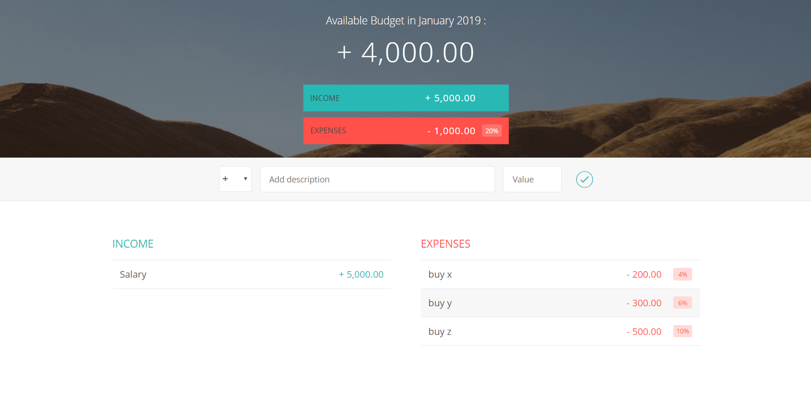

# Budgety
Simple UI to manage incomes and expenses within the current month.

It's a practice on some javaScript main concepts. 
It's part of a JavaScript course.

Screenshot for the Budgety interface

